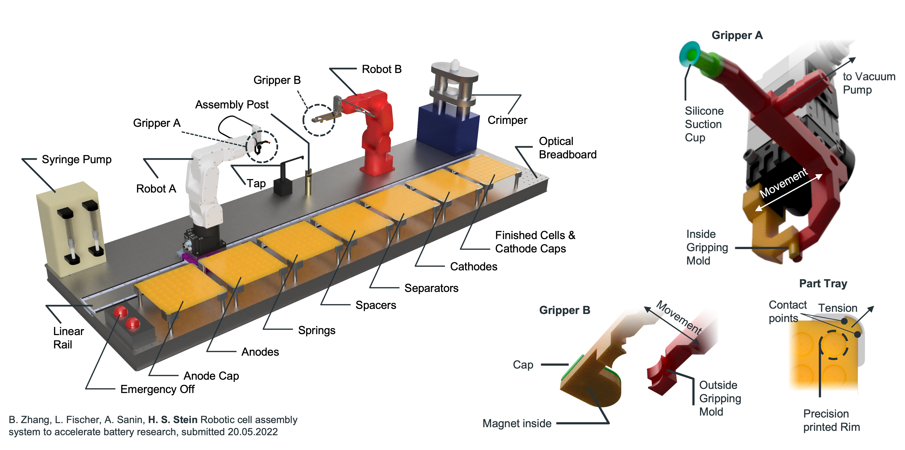

# AutoBASS 
AutoBASS deploys Automated Battery Assembly System. The motivation of this project is to meet the need of scaling-up and accuate assembly of in-house i.e. non-commercially acquired cells in battery reaserach, therefore enables the data-driven studies on optimization of active materials, electrolyte formulations, processing and manufacturing in a reproducible manner for the investigation of new chemistries.

## Abstract
In battery research, manual coin cell assembly is still the most widely used methode to manufacture the in-house cells for testing, but the precise placement of electrodes and timing of electrolyte injection are challenging for researchers who manually perform the assembly inside of a glovebox. The small variations in manufacturing processe strongly impacts the intrinsic variability the overall system performance such as capacity, resistance and degradation rate between cells, which is a crucial issue that needs to be addressed while performing the data-driven stuides, therefore, we see it35 a pressing need to automate the assembly process, enabling the manufacturing of larger numbers of cells in a reproducible manner for the investigation of new chemistries. We, therefore, build the automatic battery assembly system (AutoBASS) which is capable of assmeblying up to 64 coin cells in a batch, the main parts of AutoBASS consist of two 6-axis robotic arms (Mecademic meca500 rev.2), a linear rail (Jenny Science Linax LXS 1800), and a programmable syring pump, providing a accuracy of placement in 0.2mm and that of electrolyte despersing in 1nL. The assembly procedure is accroding to the standard assembly procedure of Coin Cell 2032 recommonded by BIG-MAP. A graphic user interface is specificly designed for proper operating of the system. Image of electrodes upon placement and real-time record of events during operating of the system were created to help keep track of the variablilty of the cells.

## Design
In principle, the assembly procedure in AutoBASS consists of three major steps i.e. placing of conponents, injection of electrolyte, and crimping of cell, which are executed by sequentially calling actions of corresponding devices. The major devieces are two 6-axis robotic arms (assemblying and transporting robots) and one linear rail. In step placing, the assemblying robot mounted on the linear rail need to work coorperatively due to the limitaion of the robot's working area i.e. the relocation of assemblying robot in x-axis will be acomplished by the linear rail, whereas changes of tool's position in y-axis will be conducted by the assembly robot. Positions of each pits on the tray are identified with numbers from 1 to 64, associated with the components' names and specific positions and saved in a json file, which will be recalled while implementing the pick-up sequence. The injection of electrolyte is executed by calling the action of the syring pump (Halmiton Microlab 600) and a step-motor-controlled rotating electrolyte tap connect to it. Images will be taken upon the placement of anode and separator using a HD camera atached to the assemblying robot.In the crimping step, the transporting robot is used first transfering the closed cell intto the pressure adjustable electric crimper (MTI MSK-160E) which will be then triggered by a mictrocontroller relay connected to it. The sealed cell will be then grapped from the crimping die and placed agian on the assembly post through a magnetic mold mounted on the transporting robot. The finished cell will be eventally transfered to the vacant position of the tray holding cathode cups.

## Structure
For each individual devices, corresponding script is implemented responsible for controlling i.e. performing the required actions at specific time for example Robots.py is responsible for all actions which will be implemented by the assemblying and transfering robots. The complete automatic assembly procedure is organized by Assembly.py. Robot_test_UI.py can be directly launched and is responsible for calibration of each positions associated with the accuracy of placing components. And if you need an easy approach to make cells, launching Autobass.py is highly recommened.

## Enviroment setup
AutoBASS is very easy-to-read and user-friendly,  besides hardware drivers you just need a working python installation.

## Launch script
AutoBaSS.py script can automatically guide you through the procedure from scratch:
    Launch 'AutoBass.py'
    Click "Assembly Coin Cell"
    Click "Initialize system" and wait for the progress bar to finish
    Type in the position of cell you want to start and to finish in numbers (No.1 refers to the cell on the up-left corner, No.64 refers to the one on the down-right corner)
    Click "Start Assembly" and the procedure will start
